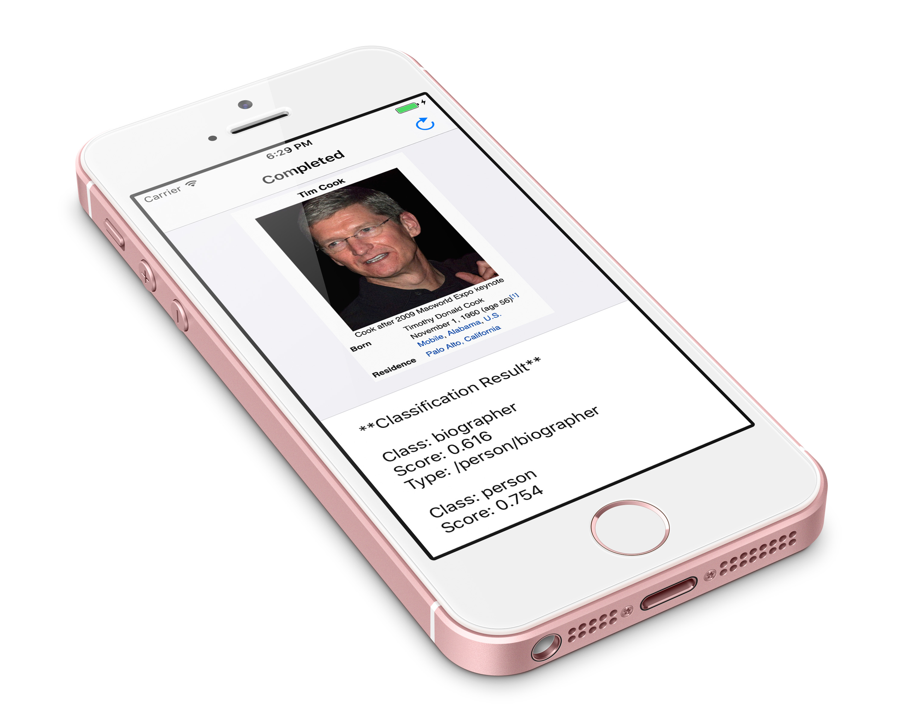

# Realm Scanner
> A Scanning App that uses IBM's Watson to perform dynamic analysis on any photos it is given.

Scanner is an app that demonstrates the event handling capabilities of the Realm Mobile Platform. Combining the deep machine learning capabilities of IBM's Bluemix technology, it is able to take any photograph, and return a textual analysis of the contents in that photograph.

# Features
- [x] Powered by the Realm Mobile Platform Professional Edition.
- [x] Performs subject analysis on any photos loaded into it.
- [x] Uses RMP as a transport mechanism for sending the data to Watson.

# Run The Demo

### Dependencies

* [Realm Mobile Platform Professional Edition](https://realm.io/pricing/realm-professional-edition/)
* Node.js

#### iOS
* CocoaPods

### Steps To Run

For a fully in-depth tutorial on running the Scanner app along with the Realm Object Server, please see [the Scanner tutorial](https://realm.io/docs/realm-mobile-platform/scanner/) on the Realm website.

#### 1. Setting up the Mobile App

##### iOS
1. Navigate to the Scanner directory in Terminal and enter `pod install` to install Realm into the Scanner app.
2. Open the `Scanner.xcworkspace` file in Xcode.

##### Android
1. In the command line, go to the `Android` directory and run `./gradlew installDebug`

#### 2. Setting up the Realm Mobile Platform

1. Download the Professional Edition of the [Realm Mobile Platform](https://realm.io/pricing/realm-professional-edition/) from the Realm website.
2. Start the Mobile Platform by running the `start-object-server.command`. Locate and copy the server "Admin Token" -- on macOS the admin access token is displayed in the Terminal window opened when you launch the server; on Linux it is located in the file `/etc/realm/admin_token.base64`.
3. If your web browser doesn't open automatically, open it, and navigate to 'http://localhost:9080'.
4. Register a user account with the username `scanner@realm.io` and the password `password`.

#### 3. Running the Scanner Global Listener

1. Open `Server/index.js` and replace the `REALM_ACCESS_TOKEN` value with the access token you previously copied.
2. Navigate to the `Server` directory in Terminal, and run `npm install` to install the Global Listener and the required supporting modules for the IBM Bluemix service.
3. Run `node .` to start the Global Listener. The Mobile Platform Terminal window should print an authorized connection.

#### 4. Running the Scanner app

1. Build and run the Scanner app from Xcode / Android Studio on the Mac that is currently running the Mobile Platform and the Global Listener processes.
2. Tap the camera icon to take a photo of something (people, places, etc).
3. The app will then start uploading the image, and will return annotations to the image when it is complete.

# Contributing

See [CONTRIBUTING.md](CONTRIBUTING.md) for more details!

This project adheres to the [Contributor Covenant Code of Conduct](https://realm.io/conduct/). By participating, you are expected to uphold this code. Please report unacceptable behavior to [info@realm.io](mailto:info@realm.io).

# License

Distributed under the Apache license. See ``LICENSE`` for more information.